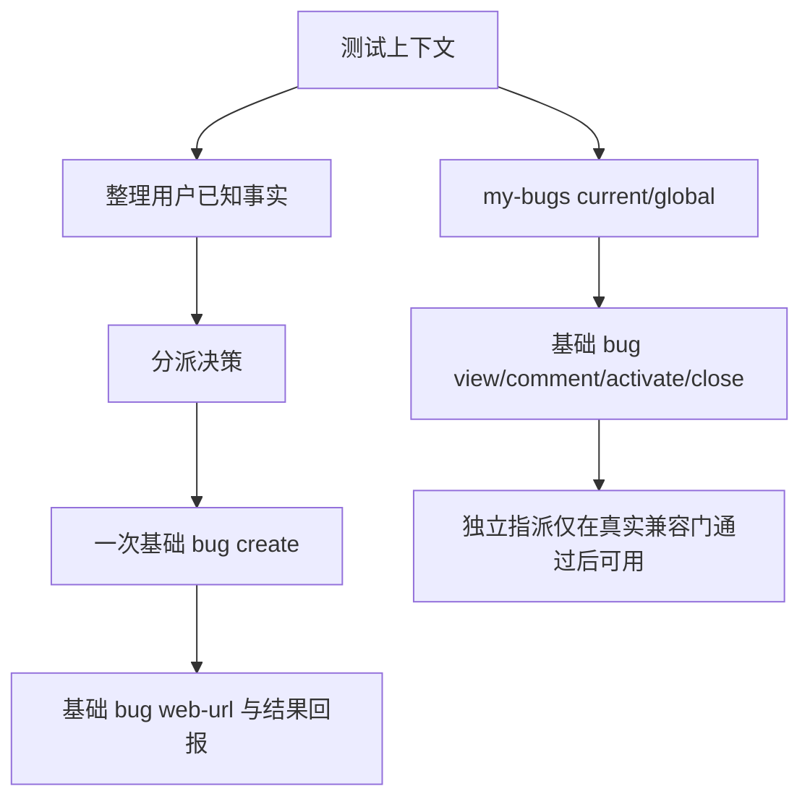

# 测试端 Bug 工作流

分派来源必须是 `explicit_assignee`、`explicit_frontend`、`explicit_backend`、
`evidence_frontend`、`evidence_backend` 或 `default_backend`。显式负责人优先于显式方向，
显式方向优先于基于用户事实的方向，无法可靠判断时使用当前模块后端负责人。

## 创建

明确“提/创建 Bug”直接执行一次 R1 `zentao` 基础 CLI 创建。缺少当前 product、module、
有效 build 或对应负责人时，写入次数为 0；Project ID 可选，没有时不强求 Project 关联；
不能依赖聊天记忆或事后备注补全。
步骤内嵌图片使用基础创建能力；明确属于备注的图片才走 comment 能力。

## 查询

普通“查我的 Bug”是当前项目范围；“查我全部 Bug”才是全局范围。脚本负责完整分页、ID
去重、关键字段冲突和 `complete/partial_failures`，编号链接由基础公开 URL 合同产生。

## 操作

测试端可编排 `view`、明确的 `comment`、明确的 `activate`、明确的 `close`。独立指派当前
仍受 T04 环境门控；只有真实 ZenTao 21.7.8 证明存在保持 active 的原生 R1 能力并完成写后
回读后，才可实现对应基础层写入。未通过时不发写请求，不用生命周期动作代替；结果未知时不重试。

测试端不接管开发修复或解决语义。用户要求查根因、修复或标记已解决时转开发端既有
`zentao-bug-resolver` 流程；测试端不发起解决写入。
