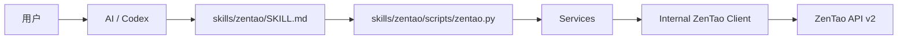
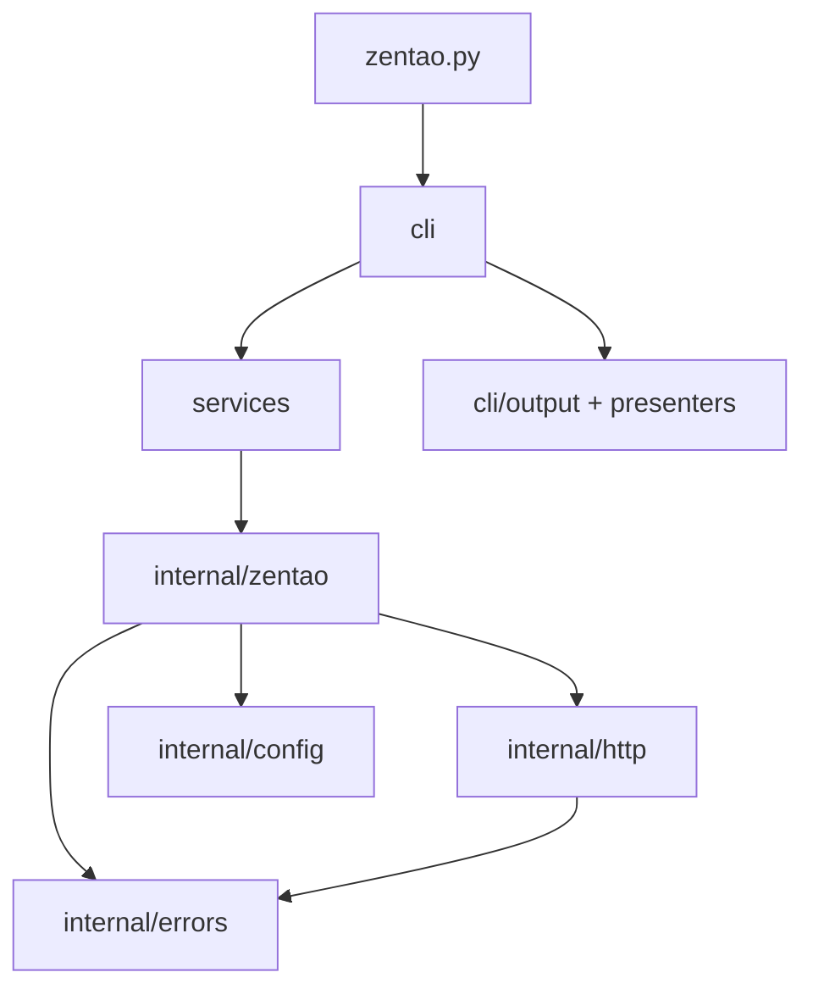

# ZenTao Skill 开发规则

> 状态：**已确认 / 当前权威规则**  
> 适用范围：`skills/zentao/` 及其运行所需的根目录本地配置  
> 来源：GitHub Issue #9 中已确认的 D-001 ～ D-015 及本轮最终收口决定  
> 后续变更：如需改变本文中的已冻结规则，应新开讨论并明确覆盖本文对应条目，不能通过实现细节静默改变。

## 1. 文档目的

本文用于冻结 `zentao` Skill 当前已经确认的项目形态、目录边界、依赖规则、配置方式、CLI 基础合同、ZenTao API v2 映射原则以及各层职责。

本文不是开发计划，也不是测试计划。后续新增测试方案、更多子命令、Story / Task / Product / Project / Execution 等能力，应在新的讨论中单独确认，不在本文提前展开。

本文只记录当前已经确认的规则。历史实现和历史讨论只用于迁移参考，不能反向覆盖本文。

---

## 2. 最高级设计原则

### 2.1 产品单元是 Skill

项目最终产品单元是：

```text
skills/zentao/
```

`zentao` 是 Skill 名称。

新的命令行能力只是该 Skill 内部的执行脚本，不作为独立 CLI 产品、独立 Python 包或系统级命令发布。

目标调用关系：



规范示例应使用 Skill 内部脚本路径，例如：

```bash
python skills/zentao/scripts/zentao.py bug view 123 --json
```

不要再把以下形式作为目标产品入口：

```bash
zentao-ai ...
```

仓库在迁移期间可能仍保留旧入口，但它属于待移除的历史实现。

### 2.2 所有实现代码归属 `skills/zentao/`

后续与该 Skill 直接相关的实现代码、命令行入口、业务服务、ZenTao API v2 适配和内部基础设施均放在：

```text
skills/zentao/
```

不再继续建设独立的：

```text
src/zentao_ai/
```

根目录允许保留仓库级文件以及本地连接配置，例如：

```text
.env
.env.example
.gitignore
```

除此之外，不应为了该 Skill 再创建新的独立应用目录。

### 2.3 ZenTao API v2 是目标行为的事实基线

新设计以 **ZenTao 官方 API v2 契约** 为第一事实来源。

设计一个命令之前，应先确认：

1. API v2 是否存在对应 endpoint；
2. HTTP method；
3. path；
4. query 参数；
5. body 字段；
6. 必填 / 可选；
7. enum / 默认值；
8. 返回结构。

旧项目源码只用于判断迁移影响，不能作为新行为的规范源。

特别禁止：

- 因为旧代码支持某能力，就默认新版也必须支持；
- 把旧客户端的自定义过滤、聚合或兼容逻辑包装成“API v2 原生能力”；
- API v2 没有公开的 endpoint，在没有新的事实验证前继续沿用旧实现。

如果目标禅道实例行为与官方文档存在差异，应在后续专项讨论中记录为“目标实例兼容差异”，不能静默写死到基础规则。

---

## 3. 明确移除 MCP

目标架构完全移除 MCP Server，不保留 optional adapter。

后续迁移中应删除或替换以下 MCP 专属实现：

```text
src/zentao_ai/server.py
plugins/zentao-ai-bug/.mcp.json
plugin manifest 中的 mcpServers
zentao-ai mcp serve
MCP required doctor check
MCP contract / stdio E2E tests
mcp 运行时依赖
```

MCP 不属于最终架构，也不应在 `skills/zentao/` 中重新出现另一套 MCP Adapter。

---

## 4. 零第三方依赖

### 4.1 硬约束

`zentao` Skill 的 Python 实现必须使用 **Python 标准库**，不引入任何第三方运行时依赖。

该约束覆盖 `skills/zentao/` 下的实现代码。后续测试设计也不得以引入第三方库作为默认前提；测试细节另行讨论。

目标运行环境：

```text
Python >= 3.11
```

### 4.2 标准库映射

| 能力 | 使用标准库 |
|---|---|
| CLI | `argparse` |
| HTTP | `urllib.request`、`urllib.parse`、`urllib.error` |
| TLS | `ssl` |
| JSON | `json` |
| 路径 | `pathlib` |
| 环境变量 | `os` |
| 数据结构 | `dataclasses`、`enum`、`typing` |
| 时间 | `datetime` |
| URL 处理 | `urllib.parse` |

明确不使用：

```text
Typer
Click
httpx
requests
Pydantic
python-dotenv
keyring
PyYAML
MCP SDK
```

不得仅为了减少少量标准库代码而重新引入第三方依赖。

### 4.3 不过度建模

API v2 是主要合同来源，因此第一版不要额外制造庞大的 DTO / ORM / Model 层。

优先使用：

```text
dict
TypedDict
dataclass
Enum
```

只有某种内部结构被多个模块稳定复用、且明确能降低复杂度时才抽成独立模型。

---

## 5. 根目录 `.env` 配置规则

### 5.1 最小配置

项目根目录使用本地 `.env` 保存 ZenTao 连接信息：

```dotenv
ZENTAO_BASE_URL=https://zentao.example.com
ZENTAO_ACCOUNT=your-account
ZENTAO_PASSWORD=your-password
```

第一版只有这三项。

不要同时引入：

```text
config.yaml
keyring
独立 token 文件
凭据数据库
多套配置系统
```

### 5.2 登录行为

脚本通过 API v2 登录接口：

```text
POST /api.php/v2/users/login
```

请求使用：

```text
account
password
```

登录成功取得 token 后，token 只存在当前 Python 进程内存中。

第一版不做 token 持久化，不自动把 token 写回 `.env`，不使用 keyring。

### 5.3 `.env` 读取

禁止依赖 `python-dotenv`。

`internal/config.py` 使用标准库自行实现最小 `.env` 读取能力，至少支持：

```dotenv
KEY=value
KEY="value"
KEY='value'
# comment
```

不需要实现完整 shell parser。

### 5.4 路径发现

脚本不能依赖调用者当前工作目录。

无论从哪里执行：

```bash
python /path/to/project/skills/zentao/scripts/zentao.py ...
```

都必须能够根据脚本自身路径定位项目根目录，并读取：

```text
<project-root>/.env
```

### 5.5 Git 安全

仓库必须提交：

```text
.env.example
```

真实 `.env` 不允许提交。

目标 `.gitignore` 语义应保证：

```gitignore
.env
.env.*
!.env.example
```

或实现等价效果。

当前仓库已有 `.env*` 规则，会连 `.env.example` 一并忽略；实际迁移时必须修正这一点。

### 5.6 敏感信息

任何模式下不得输出：

- `ZENTAO_PASSWORD`；
- 完整 token；
- Authorization / Token header；
- 带秘密的完整异常上下文。

---

## 6. 目标目录结构

当前冻结的 `skills/zentao/` 目录基线如下：

```text
skills/
└── zentao/
    ├── SKILL.md
    ├── RULES.md
    ├── agents/
    │   └── openai.yaml
    │
    └── scripts/
        ├── zentao.py
        │
        └── zentao_skill/
            ├── __init__.py
            │
            ├── cli/
            │   ├── __init__.py
            │   ├── main.py
            │   ├── output.py
            │   │
            │   ├── presenters/
            │   │   ├── __init__.py
            │   │   └── bugs.py
            │   │
            │   └── bugs/
            │       ├── __init__.py
            │       ├── create.py
            │       ├── list.py
            │       ├── view.py
            │       ├── edit.py
            │       └── lifecycle.py
            │
            ├── services/
            │   ├── __init__.py
            │   └── bugs/
            │       ├── __init__.py
            │       ├── read.py
            │       ├── write.py
            │       └── lifecycle.py
            │
            └── internal/
                ├── __init__.py
                ├── config.py
                ├── errors.py
                │
                ├── http/
                │   ├── __init__.py
                │   └── client.py
                │
                └── zentao/
                    ├── __init__.py
                    ├── auth.py
                    ├── session.py
                    └── bugs.py
```

说明：测试目录与测试策略本轮不冻结，后续专项讨论后再补入正式目录。

---

## 7. 目录语义

### 7.1 `scripts/zentao.py`

唯一内部命令入口。

只负责：

1. 导入 CLI main；
2. 执行；
3. 返回 exit code。

不要在入口文件放：

- 参数定义；
- API URL；
- 登录；
- HTTP；
- 输出格式；
- Bug 业务逻辑。

目标保持很薄，原则上应小于 50 行。

### 7.2 `cli/`

只负责“调用者怎样表达这个命令”。

主要职责：

- `argparse` 命令树；
- flag / positional 参数；
- 人类友好参数名；
- CLI 级互斥关系；
- 参数类型和范围；
- `--json`；
- exit code 转换；
- 默认人类可读输出。

`cli/` 不知道：

- `/api.php/v2`；
- endpoint URL；
- token header；
- `urllib`；
- 登录请求；
- HTTP status 细节。

### 7.3 `cli/bugs/`

Bug 命令按操作拆文件，避免一个 `bug.py` 持续膨胀。

第一版：

```text
create.py
list.py
view.py
edit.py
lifecycle.py
```

`lifecycle.py` 当前容纳：

```text
resolve
close
activate
```

如果未来该文件接近体积警戒线，应进一步拆为：

```text
resolve.py
close.py
activate.py
```

不要等到文件已经成为巨型模块后再处理。

### 7.4 `cli/presenters/`

只负责默认人类可读展示。

例如：

- Bug 列表表格；
- Bug 详情排版；
- 写操作成功消息。

Presenter 不调用 Services，不调用 HTTP，不做业务决定。

### 7.5 `cli/output.py`

负责公共输出合同：

- 普通文本模式；
- `--json`；
- stdout / stderr；
- error JSON；
- ANSI / 日志隔离；
- exit code。

### 7.6 `services/`

Services 是 CLI 与 ZenTao 内部客户端之间的应用用例层。

职责是表达：

> “当前这个 Skill 操作具体意味着什么。”

Services 可以负责：

- 接受 CLI 已解析的业务参数；
- 组织一个明确用例；
- 根据 scope 选择对应 ZenTao API v2 调用；
- 把人类命令语义整理成内部调用语义；
- 保持一条命令只触发一个明确 API 操作；
- 将 Internal 的结果交回 CLI。

Services 不负责：

- `argparse`；
- print；
- URL 拼接；
- token header；
- `urllib`；
- 自动追加额外 GET；
- 自动执行第二个业务动作。

### 7.7 `services/bugs/`

初始职责划分：

```text
read.py
    list
    view

write.py
    create
    edit

lifecycle.py
    resolve
    close
    activate
```

以后同类职责变大时继续按操作或子域拆分。

### 7.8 `internal/`

`internal/` 是 Skill 的内部实现细节，不提供对外 API。

这里的模块只允许被 `services/` 或同层内部基础设施使用。

### 7.9 `internal/zentao/`

这里才放 **ZenTao API v2 的协议适配**。

这个目录下的方法应尽量能与官方 API v2 endpoint 一一对应。

#### `auth.py`

只负责登录相关 API。

#### `session.py`

负责：

- base URL；
- `/api.php/v2` 根路径；
- 当前进程 token；
- GET / POST / PUT 等调用入口；
- 向 `internal/http/` 委托实际网络发送。

#### `bugs.py`

第一版方法建议与 API v2 对齐：

```text
create
list_product
list_project
list_execution
get
edit
resolve
close
activate
```

这里不出现旧 MCP 风格名称，例如：

```text
query_my_bugs
query_team_bugs
query_user_bugs
search_bugs
add_bug_comment
assign_bug
```

### 7.10 `internal/http/`

纯传输层。

只负责：

- urllib request；
- query 编码；
- JSON encode / decode；
- Content-Type；
- timeout；
- HTTP status；
- 网络异常；
- TLS；
- 响应体读取。

这一层禁止知道：

```text
Bug
Story
Task
Product
Project
Execution
resolution
openedBuild
```

### 7.11 `internal/config.py`

只负责：

- 定位项目根目录；
- 读取 `.env`；
- 解析配置；
- 检查三个必需连接值。

### 7.12 `internal/errors.py`

集中定义稳定的内部错误类型和错误 code。

不要在不同模块随意 `raise RuntimeError("...")`。

错误对象至少能够形成：

```json
{
  "error": {
    "code": "...",
    "message": "...",
    "details": {}
  }
}
```

---

## 8. 严格依赖方向

依赖只能向下：



允许：

```text
entry -> cli
cli -> services
services -> internal/zentao
internal/zentao -> internal/http
```

禁止：

```text
internal/http -> services
internal/zentao -> cli
services -> cli
presenters -> services
```

也禁止跨层绕行，例如：

```text
cli -> internal/http
cli -> urllib
services -> urllib
```

如果发现某个功能只能通过反向依赖实现，应先重新划分职责，不能直接打破层级。

---

## 9. 校验职责边界

原则：

> 越靠外层越处理表达和格式，越靠内层越处理 API 契约；同一条规则不要在三层重复实现。

### 9.1 CLI 层校验

CLI 负责用户输入形式能否构成合法命令。

例如：

- 必需 positional / flag 是否存在；
- ID 是否为正整数；
- `--page >= 1`；
- `1 <= --per-page <= 1000`；
- `--order` 不能脱离 `--sort`；
- `--product / --project / --execution` 对 list 必须且只能选择一个；
- `--steps` 与 `--steps-file` 互斥；
- `--comment` 与 `--comment-file` 互斥；
- `edit` 至少提供一个修改字段；
- enum 是否属于当前命令公开的合法 CLI 值。

CLI 输入不合法：

```text
exit 2
```

不要发出 HTTP 请求。

### 9.2 Services 层校验

Services 负责应用用例语义，不重复 CLI parser 的纯格式检查。

Services 应确保：

- 当前命令只执行一个明确操作；
- list scope 被转换到一个确定的资源调用；
- create / edit / lifecycle 参数被组织成对应操作；
- 不因为旧实现习惯额外执行第二个动作；
- 不隐式补充调用者没有要求的业务行为。

Services 不应重新实现 ZenTao API 官方的服务端权限、状态机或业务校验。

如果 API v2 明确要求某字段，CLI / Services 可以在发请求前做确定性校验；无法从本地确定的服务器业务规则应交给 ZenTao 返回真实错误。

### 9.3 Internal ZenTao 层校验

`internal/zentao/` 负责 API v2 协议合同：

- endpoint；
- HTTP method；
- API 字段名；
- query 字段；
- body 字段；
- API enum 映射；
- API 路径参数。

例如：

```text
priority -> pri
affected_build -> openedBuild
assignee -> assignedTo
```

这些 API 字段映射不要散落在 CLI 中。

### 9.4 HTTP 层校验

HTTP 层只验证传输层问题：

- URL 是否可构造；
- scheme 是否受支持；
- request body 是否可编码；
- response 是否为可解析 JSON（需要 JSON 的接口）；
- timeout / connection / HTTP status。

HTTP 层不判断 Bug 是否允许关闭、resolution 是否合理等业务规则。

### 9.5 Config 层校验

配置层只检查：

```text
ZENTAO_BASE_URL
ZENTAO_ACCOUNT
ZENTAO_PASSWORD
```

是否存在、是否为空、URL 是否满足最低连接要求。

---

## 10. CLI 基础风格

### 10.1 GitHub CLI 风格

内部 CLI 采用“资源 + 动作”结构：

```text
bug create
bug list
bug view
bug edit
bug resolve
bug close
bug activate
```

不要采用：

```text
invoke <operation>
query_my_bugs
search_bugs
```

这种偏 RPC / Tool 的命名。

### 10.2 默认人类可读

不带 `--json` 时输出供人直接阅读的文本或表格。

### 10.3 `--json`

带 `--json` 时输出稳定机器结果。

成功：

- stdout 只包含 JSON；
- 不再套通用 `{ "ok": true, "data": ... }` 包装；
- 写命令可直接保留 API v2 的简单成功结果，例如 `status` / `id`；
- 读取命令可输出稳定命令结果；
- 不额外暴露一个无法保证稳定性的 `raw` 大对象。

失败：

- stdout 为空；
- stderr 输出：

```json
{
  "error": {
    "code": "...",
    "message": "...",
    "details": {}
  }
}
```

`--json` 模式 stdout 禁止混入：

- 登录提示；
- 进度提示；
- debug log；
- warning 文本；
- ANSI 颜色。

### 10.4 Exit code

| code | 含义 |
|---:|---|
| `0` | 命令成功 |
| `1` | API / 认证 / 网络 / 业务运行失败 |
| `2` | CLI 参数或用法错误 |
| `130` | Ctrl+C 中断 |

不要为每一种 API 错误设计独立 exit code；具体错误由 `error.code` 表达。

---

## 11. 一条命令只执行一个明确操作

这是硬规则。

例如：

```text
bug view
→ 只执行 GET /bugs/:id

bug resolve
→ 只执行 PUT /bugs/:id/resolve
```

禁止在一个命令内部隐式追加：

- 写后自动 GET；
- 自动刷新；
- 自动补查；
- 自动第二次写；
- 无依据重试；
- 因为“展示更完整”而追加额外 API 请求。

如果上层调用者需要多个操作，应显式调用多个命令。

---

## 12. 写操作与不确定结果

### 12.1 普通写操作不使用 `--confirm`

明确的写命令本身已经表达操作意图，因此普通写操作不增加通用：

```text
--confirm
```

例如：

```text
bug edit
bug resolve
bug close
bug activate
bug create
```

直接执行对应操作。

### 12.2 高破坏性操作

未来如果新增真正不可逆 / 高破坏性的操作，可以单独设计：

- TTY 交互确认；
- `--yes` 用于非交互明确跳过确认。

不能把该机制提前泛化到所有写命令。

### 12.3 删除 Bug

ZenTao API v2 虽然提供删除接口，本项目当前明确 **不暴露 Bug 删除命令**。

不要添加：

```text
bug delete
```

### 12.4 `UNKNOWN_WRITE_RESULT`

如果写请求已经可能送达服务器，但因为网络中断等原因无法确认最终结果：

- 返回稳定 `UNKNOWN_WRITE_RESULT`；
- 当前命令到此结束；
- 不自动重试；
- 不自动 GET；
- 不自动判断服务器最终状态。

后续是否执行 `bug view`，由调用者显式决定。

---

## 13. 当前冻结的 Bug API v2 基础命令

本轮只冻结已经讨论确认的基础命令面：

```text
bug create
bug list
bug view <id>
bug edit <id>
bug resolve <id>
bug close <id>
bug activate <id>
```

更多子命令不在本文中设计。

### 13.1 不继承的旧命令

旧项目曾有独立：

```text
assign
comment
```

当前官方 Bug API v2 目录没有把它们作为独立基础 endpoint，因此新版不因为历史实现而继承：

```text
bug assign
bug comment
```

如果未来发现目标实例有正式、可验证的 API v2 扩展，另行讨论。

---

## 14. `bug list` 规则

### 14.1 Scope 对应三个原生 endpoint

```text
--product <id>
→ GET /api.php/v2/products/:productID/bugs

--project <id>
→ GET /api.php/v2/projects/:projectID/bugs

--execution <id>
→ GET /api.php/v2/executions/:executionID/bugs
```

一次 `bug list` 必须且只能选择一个 scope。

这里的互斥来自 API v2 的资源 endpoint 边界，不来源于旧 `BugFilters`。

### 14.2 CLI 参数映射

API v2 原生列表参数使用人类友好名称：

```text
--browse
--sort
--order
--page
--per-page
```

内部映射到：

```text
browseType
orderBy
pageID
recPerPage
```

### 14.3 `--browse`

产品 scope：

```text
all
unclosed
assigned-to-me
opened-by-me
assigned-by-me
```

对应 API：

```text
all
unclosed
assignedtome
openedbyme
assignedbyme
```

项目 / 执行 scope：

```text
all
unresolved
```

CLI 必须根据 scope 提前拒绝 API 不支持的 browse 值。

### 14.4 排序

CLI：

```text
--sort id|title|status
--order asc|desc
```

内部组合为 API `orderBy`。

`--order` 不能单独出现。

### 14.5 分页

```text
--page >= 1
1 <= --per-page <= 1000
```

分别映射：

```text
pageID
recPerPage
```

### 14.6 不覆盖 API 默认值

用户没有显式传入某个参数时，CLI 不自行补默认值，应让对应 API v2 endpoint 使用自己的默认行为。

例如产品和项目列表的 `browseType` 默认值不同，CLI 不应该人为统一。

### 14.7 第一版不提供自动全量聚合

当前基础合同不增加：

```text
--limit
自动翻完所有页
跨 product/project/execution 聚合
本地 priority/severity/keyword/time 过滤
```

这些都属于 API v2 之上的增强能力，后续如需支持必须另开讨论。

---

## 15. `bug view`

```text
GET /api.php/v2/bugs/:bugID
```

命令：

```bash
python skills/zentao/scripts/zentao.py bug view 123
python skills/zentao/scripts/zentao.py bug view 123 --json
```

`bug view` 只读取一次详情，不自动下载附件、不自动读取图片、不自动进行后续请求。

附件 / 图片能力后续另行讨论。

---

## 16. `bug create`

API：

```text
POST /api.php/v2/bugs
```

CLI 基础参数映射：

| CLI | API v2 |
|---|---|
| `--product` | `productID` |
| `--title` | `title` |
| `--affected-build` | `openedBuild` |
| `--project` | `project` |
| `--execution` | `execution` |
| `--severity` | `severity` |
| `--priority` | `pri` |
| `--type` | `type` |
| `--steps` | `steps` |
| `--story` | `story` |

基础必填：

```text
--product
--title
至少一个 --affected-build
```

`--affected-build` 支持重复。

API v2 没有声明 `project` 与 `execution` 互斥，因此 CLI 不自行增加互斥规则。

CLI 不主动填充 API 已有默认值，例如 severity / priority；未传时直接省略。

允许输入便利：

```text
--steps
--steps-file
```

二者互斥。

---

## 17. `bug edit`

API：

```text
PUT /api.php/v2/bugs/:bugID
```

当前基础字段：

```text
title
severity
pri
type
openedBuild
steps
project
execution
story
```

对应 CLI 延续 `create` 的人类友好命名。

规则：

- Bug ID 必须存在；
- 至少提供一个修改字段；
- 不支持 API v2 edit endpoint 没有的 `assignedTo` / `comment` 字段；
- 不自动 GET 验证最终状态。

---

## 18. `bug resolve`

API：

```text
PUT /api.php/v2/bugs/:bugID/resolve
```

CLI：

```text
--resolution        必填
--resolved-date     可选
--resolved-build    可选
--assignee          可选
--comment           可选
--comment-file      可选
```

`--comment` 与 `--comment-file` 互斥。

当前官方 resolution enum：

```text
fixed
notrepro
bydesign
duplicate
external
postponed
willnotfix
tostory
```

只使用 API v2 已明确的参数，不根据旧版本经验自行补 `duplicateBug` 等未确认字段。

---

## 19. `bug close`

API：

```text
PUT /api.php/v2/bugs/:bugID/close
```

基础参数：

```text
--comment
--comment-file
```

二者互斥，均可选。

关闭命令只执行 close endpoint。

---

## 20. `bug activate`

API：

```text
PUT /api.php/v2/bugs/:bugID/activate
```

基础参数：

```text
--affected-build
--assignee
--comment
--comment-file
```

`--affected-build` 可重复；评论两种输入方式互斥。

激活命令只执行 activate endpoint。

---

## 21. 文件体积与拆分规则

目标是通过目录职责控制复杂度，而不是等文件巨大后再重构。

建议：

| 文件类型 | 目标规模 |
|---|---:|
| `scripts/zentao.py` | `< 50` 行 |
| `cli/bugs/*.py` | 尽量 `< 150` 行 |
| `services/bugs/*.py` | 尽量 `< 200` 行 |
| `internal/zentao/*.py` | 尽量 `< 250` 行 |
| 其他生产模块 | 到约 `300` 行时检查职责 |
| 任意生产文件 | `500` 行为硬警戒线 |

达到软警戒线时，应检查：

- 是否同时承担参数、业务、HTTP、输出多个职责；
- 是否可以按操作拆文件；
- 是否可以按 read / write / lifecycle 拆；
- 是否存在不合理的跨层调用。

不要通过压缩可读性、减少空行或把多个职责挤进同一个类来“满足行数”。

---

## 22. 未来横向扩展规则

未来如果增加新的 ZenTao 资源，应沿同一模式横向扩展：

```text
cli/stories/
services/stories/
internal/zentao/stories.py
```

例如 Task：

```text
cli/tasks/
services/tasks/
internal/zentao/tasks.py
```

共享：

```text
internal/config.py
internal/errors.py
internal/http/
internal/zentao/auth.py
internal/zentao/session.py
cli/output.py
```

不要为每个资源复制一套 HTTP / Auth / Config。

当新资源的 ZenTao API v2 能力需要设计 CLI 时，应先开新的讨论，再扩充本文或新增专项规则。

---

## 23. 明确禁止的架构回退

除非后续新讨论明确覆盖本文，否则禁止：

1. 恢复 MCP Server；
2. 把 MCP 作为 optional adapter 重新加入；
3. 重新发布独立 `zentao-ai` 系统 CLI；
4. 重新建立独立 `src/zentao_ai/` 应用作为主实现；
5. 新建与 `cli/` 平级、容易被理解为项目对外 API 的顶层 `api/`；
6. 把所有 Bug 命令重新堆进单个 `cli/bug.py`；
7. 引入第三方 Python 依赖；
8. 用旧项目自定义 `BugFilters` 作为新版 API 合同；
9. 因旧代码存在就继续保留 API v2 未证明的独立 `assign/comment`；
10. 写操作后自动 GET；
11. `UNKNOWN_WRITE_RESULT` 后自动重试或自动查询；
12. 把 API v2 之上的客户端增强伪装成 API 原生能力。

---

## 24. 当前迁移差距说明

本文描述的是目标规则，不代表当前 `main` 已完成迁移。

当前仓库仍存在旧形态，包括独立 Python package、第三方依赖、MCP、旧 Skill 路径和旧文档等。后续实施时需要按新的开发计划逐项迁移。

任何“当前已完成”的声明都必须以实际代码修改和验证结果为准。

---

## 25. 本轮明确延期 / 非目标

以下内容不在本文继续设计：

- 测试目录最终形态；
- 单元 / 集成 / E2E 测试策略；
- Fake ZenTao Server 方案；
- CI；
- 更多 Bug 子命令；
- 独立 assign/comment 能力；
- 自动全量分页；
- 客户端复杂过滤；
- 图片 / 附件下载和理解；
- Story；
- Task；
- Product 管理；
- Project 管理；
- Execution 管理；
- Build / Release；
- 其他 ZenTao API v2 资源。

这些内容应在后续讨论中逐项确定，不允许在实现时顺手扩散。

---

## 26. 决策追溯

本规则文档继承 Issue #9 的最终有效决定：

| 决策 | 当前有效结论 |
|---|---|
| D-001 | 主链路转向 Skill + scripts + API v2 |
| D-002 | 完全移除 MCP |
| D-003 | CLI 使用 GitHub CLI 风格，默认人类可读，`--json` 机器输出 |
| D-004 | 普通写操作不使用 `--confirm` |
| D-005 | JSON / stderr / exit code 合同 |
| D-006 | API v2 为新设计事实基线 |
| D-007 | `bug list` 统一入口映射三个原生 scope endpoint |
| D-008 | list 原生参数采用薄 CLI 映射 |
| D-009 | 不继承旧版本未被 API v2 证明的能力 |
| D-010 | create/edit/resolve/close/activate 按 API v2 契约 |
| D-011 | 一个命令只执行一个明确操作，不追加隐式 API 调用 |
| D-012 | 项目收敛为单一 `zentao` Skill，CLI 为内部 script |
| D-013 | 根目录 `.env` 最小连接配置，token 不持久化 |
| D-014 | `scripts/` 分层、可扩展、零第三方依赖目录结构 |
| D-015 | CLI / Services / Internal 职责与校验边界 |

如果历史评论与本文冲突，以**更晚且未被再次覆盖的决定**和本文为准。
